# Diagrama de clases UML

El diagrama está escrito en Mermaid, que GitHub renderiza automáticamente.

```mermaid
classDiagram
direction TB

%% ===== FLYWEIGHT =====
class ElementoGrafico {
  <<interface>>
  +dibujar(int x, int y, String color, double escala) String
}
class Glifo { -char caracter  -String tipografia }
class Icono { -String nombre  -String imagen }
class GlifoColocado { <<record>> elemento  x  y  color  escala }
class GlifoFactory {
  -Map pool
  +getGlifo(char c, String tipografia) Glifo
  +getIcono(String nombre) Icono
}
class Maquetador { +maquetar(String texto, String tipografia, String color, double escala) List~GlifoColocado~ }
ElementoGrafico <|.. Glifo
ElementoGrafico <|.. Icono
GlifoFactory o-- Glifo : reutiliza
GlifoFactory o-- Icono : reutiliza
GlifoColocado --> ElementoGrafico
Maquetador ..> GlifoFactory
Maquetador ..> GlifoColocado

%% ===== MODELO + BUILDER =====
class Bloque { -TipoBloque tipo  -String texto  +transformar(UnaryOperator f) }
class Contenido { -String titulo  +getBloques() List~Bloque~ }
class DocumentBuilder {
  <<interface>>
  +addHeader(String) DocumentBuilder
  +addParagraph(String) DocumentBuilder
  +addTable(String[][]) DocumentBuilder
  +addFooter(String) DocumentBuilder
  +build() Contenido
}
class BaseDocumentBuilder { <<abstract>> }
class ReporteEjecutivoBuilder
class FacturaSimpleBuilder
DocumentBuilder <|.. BaseDocumentBuilder
BaseDocumentBuilder <|-- ReporteEjecutivoBuilder
BaseDocumentBuilder <|-- FacturaSimpleBuilder
BaseDocumentBuilder ..> Contenido : crea
Contenido *-- Bloque
Bloque *-- GlifoColocado : usa flyweights
Bloque --> Icono
BaseDocumentBuilder ..> GlifoFactory

%% ===== BRIDGE =====
class Documento {
  <<abstract>>
  #RenderizadorEngine renderizador
  +exportar() String
}
class DocumentoPaginado
class DocumentoContinuo
class RenderizadorEngine {
  <<interface>>
  +encabezado(Bloque) String
  +parrafo(Bloque) String
  +tabla(Bloque) String
  +pie(Bloque) String
  +envolver(String titulo, String cuerpo) String
}
class PdfRenderEngine
class HtmlRenderEngine
class MarkdownRenderEngine
Documento <|-- DocumentoPaginado
Documento <|-- DocumentoContinuo
Documento o-- RenderizadorEngine : puente
Documento --> Contenido
RenderizadorEngine <|.. PdfRenderEngine
RenderizadorEngine <|.. HtmlRenderEngine
RenderizadorEngine <|.. MarkdownRenderEngine

%% ===== CHAIN OF RESPONSIBILITY =====
class ProcesadorHandler {
  <<abstract>>
  -ProcesadorHandler siguiente
  +setSiguiente(ProcesadorHandler) ProcesadorHandler
  +manejar(Contenido, Contexto, ReporteProceso) void
  #procesar(Contenido, Contexto, ReporteProceso) void
}
class ValidadorSintaxis
class SanitizadorPalabras
class EvaluadorExpresiones
class ReporteProceso { -boolean critico }
ProcesadorHandler o-- ProcesadorHandler : siguiente
ProcesadorHandler <|-- ValidadorSintaxis
ProcesadorHandler <|-- SanitizadorPalabras
ProcesadorHandler <|-- EvaluadorExpresiones
ProcesadorHandler ..> ReporteProceso
ProcesadorHandler ..> Contenido

%% ===== INTERPRETER =====
class Expresion { <<interface>> +interpretar(Contexto) double }
class ExpresionTerminal { <<interface>> }
class ExpresionNumero
class ExpresionVariable
class ExpresionNoTerminal { <<abstract>> #operar(double, double) double }
class Suma
class Resta
class Multiplicacion
class Division
class ExpresionParser { +parsear(String) Expresion }
class Contexto { -Map variables  -Map textos }
Expresion <|-- ExpresionTerminal
Expresion <|.. ExpresionNoTerminal
ExpresionTerminal <|.. ExpresionNumero
ExpresionTerminal <|.. ExpresionVariable
ExpresionNoTerminal <|-- Suma
ExpresionNoTerminal <|-- Resta
ExpresionNoTerminal <|-- Multiplicacion
ExpresionNoTerminal <|-- Division
ExpresionNoTerminal o-- Expresion : izquierda / derecha
ExpresionParser ..> Expresion
Expresion ..> Contexto
EvaluadorExpresiones ..> ExpresionParser : usa Interpreter

%% ===== MEDIATOR =====
class Mediator { <<interface>> +notificar(Componente, String evento, String dato) }
class DocumentEditorMediator
class Componente { <<abstract>> #Mediator mediator }
class SelectorDeFormato
class BarraDeHerramientasBuilder
class VistaPrevia
class BotonExportar
Mediator <|.. DocumentEditorMediator
Componente --> Mediator
Componente <|-- SelectorDeFormato
Componente <|-- BarraDeHerramientasBuilder
Componente <|-- VistaPrevia
Componente <|-- BotonExportar
DocumentEditorMediator --> SelectorDeFormato
DocumentEditorMediator --> BarraDeHerramientasBuilder
DocumentEditorMediator --> VistaPrevia
DocumentEditorMediator --> BotonExportar
DocumentEditorMediator --> DocumentBuilder : reconfigura
DocumentEditorMediator --> RenderizadorEngine : reconfigura
DocumentEditorMediator --> ProcesadorHandler : ejecuta cadena
DocumentEditorMediator ..> Documento : crea
```

## Flujo entre patrones

1. **Mediator**: el usuario cambia formato o tipo de documento; el mediador elige el `DocumentBuilder` y el `RenderizadorEngine`.
2. **Builder + Flyweight**: el builder arma el `Contenido`; cada carácter e icono se obtiene de `GlifoFactory`.
3. **Chain of Responsibility**: `ValidadorSintaxis` → `SanitizadorPalabras` → `EvaluadorExpresiones`; un error crítico detiene la cadena.
4. **Interpreter**: `EvaluadorExpresiones` convierte cada `#{...}` en un árbol de expresiones y lo evalúa.
5. **Bridge**: `DocumentoPaginado` o `DocumentoContinuo` exporta con el `RenderizadorEngine` elegido.
